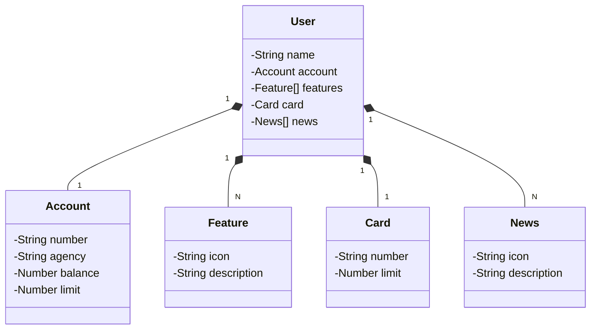

# Esse é um projeto sobre a construção de uma API RESTful 👨‍💻


```
Realizei este projeto com as seguintes tecnologias:

Java - SpringBoot (JPA, PostgreSQL Driver, Lombok, Dev Tools)
Gradle - Gerenciador de dependências
PostgreSQL - Banco de Dados
RailWay - Hospedagem
Figma - Design do projeto
MVC e Design Patterns
```


## Diagrama de Classes (Domínio da API)




```

```