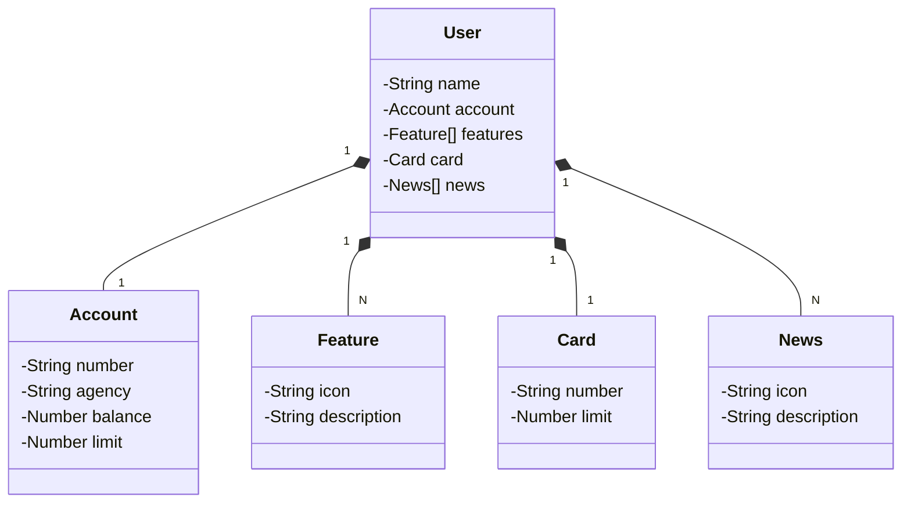

# API RESTful 👨‍💻

O conceito deste projeto é implementar a construção de uma API de um banco digital, 
realizando todas as principais funções e integrando ao banco de dados.

Esse Projeto é uma base de estudos que obtive através do BootCamp DIO SANTANDER 2024, 
houveram algunas modificações e haverão mais modificações na API, principalmente nos endpoints.

```
Realizei este projeto com as seguintes tecnologias:

Java - SpringBoot (JPA, PostgreSQL Driver, Lombok, Dev Tools)
Gradle - Gerenciador de dependências
PostgreSQL - Banco de Dados
RailWay - Hospedagem
Figma - Design do projeto
MVC e Design Patterns
```

## [Link do Projeto no Figma](https://www.figma.com/file/0ZsjwjsYlYd3timxqMWlbj/SANTANDER---Projeto-Web%2FMobile?type=design&node-id=1421%3A432&mode=design&t=6dPQuerScEQH0zAn-1)


## Diagrama de Classes (Domínio da API)




```

```